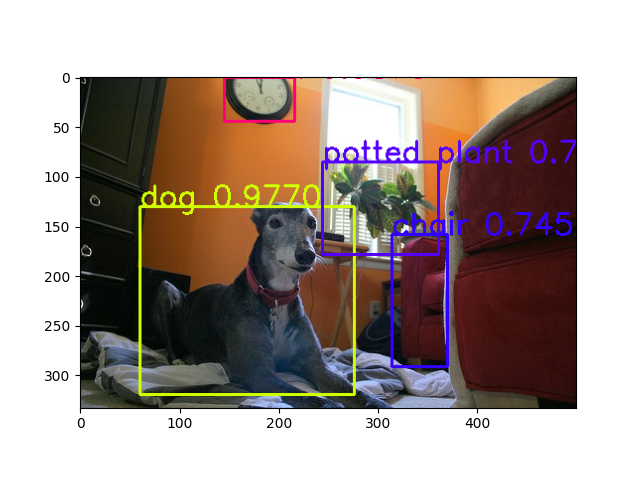
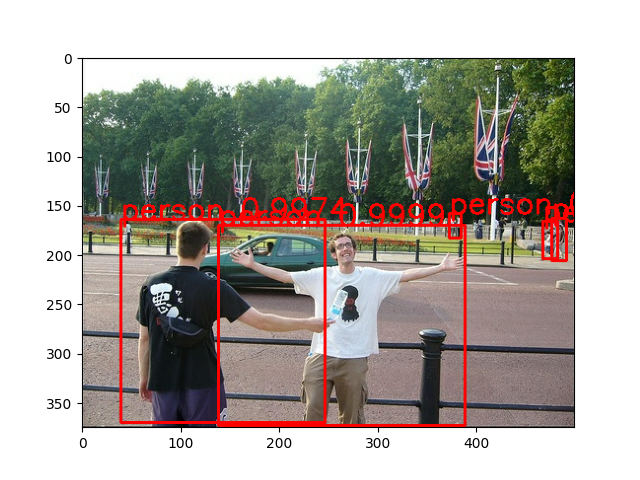
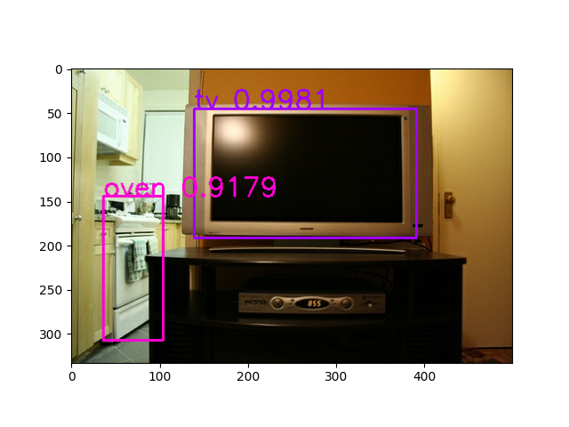
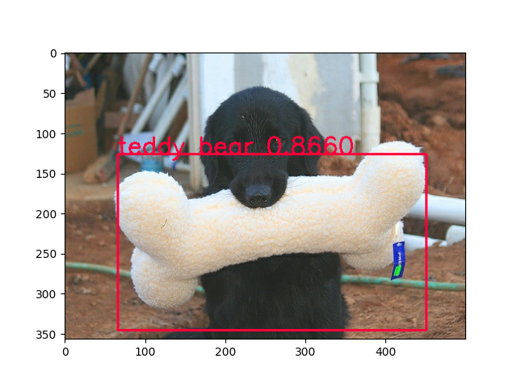
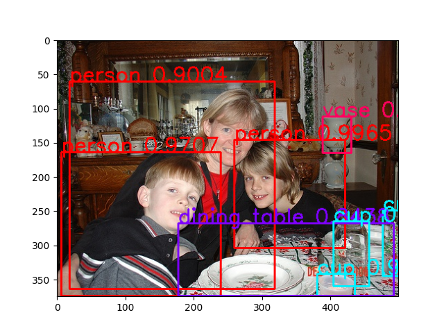
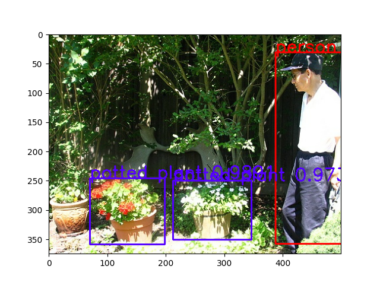
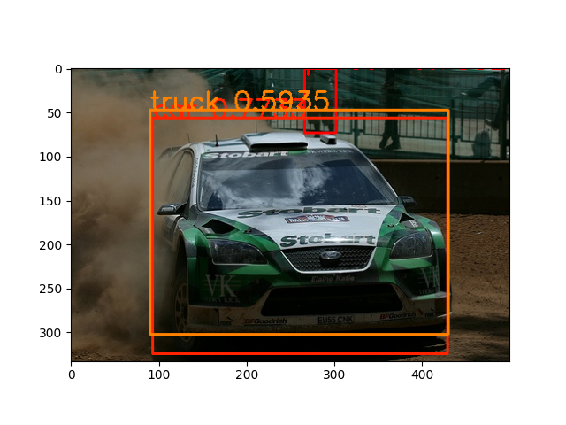
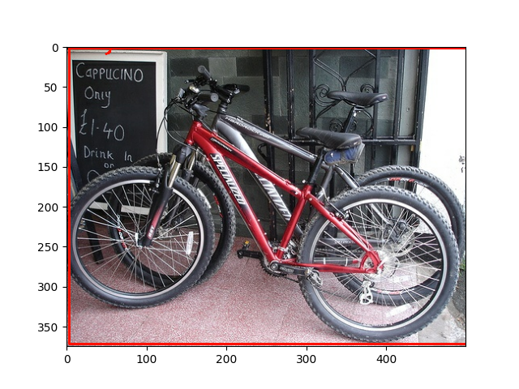
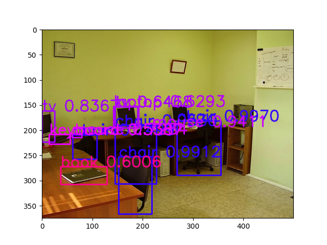
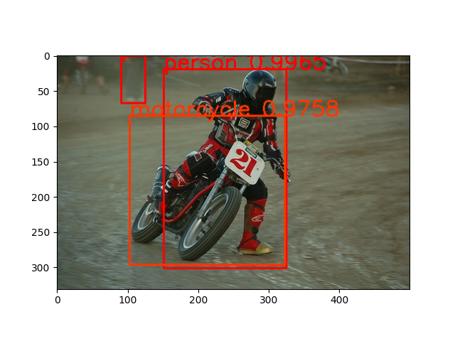

# TensorFlow 2.0 YOLO-V3

這個專案實現了TensorFlow2.0 YOLO-V3物件偵測。


## Usage

- Requirements
    - [Numpy == 1.26.4](http://www.numpy.org/)
    
    - [OpenCV == 4.10.0.84](https://opencv.org/)
    
    - [Matplotlib == 3.9.2](https://matplotlib.org/)
    
    - [TensorFlow == 2.14.0](https://www.tensorflow.org/versions/r2.0/api_docs/python/tf)
    
    - [TensorFlow Datasets == 4.9.6](https://www.tensorflow.org/datasets/)
    
    - [Tensorflow Addons == 0.22.0](https://github.com/tensorflow/addons)

- DarkNet weights 轉換到 TensorFlow weights
    ```bash
    python convert.py
    ```

- YOLO-V3訓練
    ```bash
    python train.py
    ```

- YOLO-V3多尺度訓練(multi scale training)
    ```bash
    python train-multi-scale.py
    ```

- YOLO-V3測試
    ```bash
    python test.py
    ```


- TensorBoard觀察訓練紀錄
    ```bash
    tensorboard --logdir logs_yolo
    ```

## Results

Predict by YOLO v3 original weights












## References

- https://github.com/pjreddie/darknet
	- YOLO-V3原作者程式碼(DarkNet)
- https://github.com/qqwweee/keras-yolo3
	- 網路模型
- https://github.com/zzh8829/yolov3-tf2
	- 損失函數
	- 資料預處理
- https://github.com/allanzelener/YAD2K
	- DarkNet到Keras網路模型轉換
